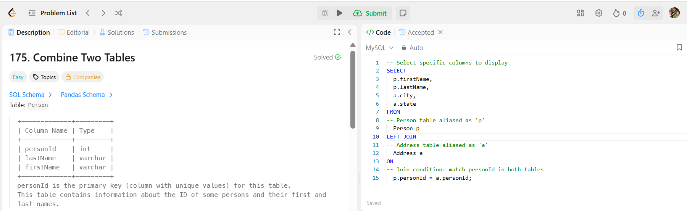

🎯 𝐏𝐫𝐨𝐛𝐥𝐞𝐦: 

Combine Two Table(𝐋𝐞𝐞𝐭𝐂𝐨𝐝𝐞 #𝟏𝟕𝟓)

https://leetcode.com/problems/department-top-three-salaries/description/

📌 𝐂𝐡𝐚𝐥𝐥𝐞𝐧𝐠𝐞 𝐒𝐮𝐦𝐦𝐚𝐫𝐲:

The task is to show the first name, last name, city, and state for each person from the 𝐏𝐞𝐫𝐬𝐨𝐧 table.

📂 𝐓𝐚𝐛𝐥𝐞𝐬 𝐈𝐧𝐯𝐨𝐥𝐯𝐞𝐝:

𝐏𝐞𝐫𝐬𝐨𝐧: stores person details  - personId, firstName, lastName
𝐀𝐝𝐝𝐫𝐞𝐬𝐬: stores address details - addressId, personId, city, state

✅ 𝐄𝐱𝐩𝐞𝐜𝐭𝐞𝐝 𝐎𝐮𝐭𝐩𝐮𝐭:

The output should include each person's first name, last name, city, and state. If no address is available, city and state should be 𝐧𝐮𝐥𝐥.

🔍 𝐊𝐞𝐲 𝐒𝐐𝐋 𝐂𝐨𝐧𝐜𝐞𝐩𝐭𝐬 𝐔𝐬𝐞𝐝:

𝐓𝐚𝐛𝐥𝐞 𝐀𝐥𝐢𝐚𝐬𝐢𝐧𝐠: This shortens table references and improves readability.
𝐋𝐄𝐅𝐓 𝐉𝐎𝐈𝐍: Ensures all records from Person are included, even if there's no matching row in Address.

💡 𝐖𝐡𝐚𝐭 𝐈 𝐋𝐞𝐚𝐫𝐧𝐞𝐝:

Practice using table aliases (𝐩, 𝐚) for cleaner and more readable SQL code.

Learn how to gracefully include and work with 𝐍𝐔𝐋𝐋 values when data is incomplete or missing in related tables.

Understand the use of 𝐋𝐄𝐅𝐓 𝐉𝐎𝐈𝐍 to retrieve all records from one table, even when there's no matching entry in the joined table.

🧩 𝑺𝒎𝒂𝒍𝒍 𝒒𝒖𝒆𝒓𝒊𝒆𝒔. 𝑩𝒊𝒈 𝒊𝒏𝒔𝒊𝒈𝒉𝒕𝒔. 𝑻𝒉𝒂𝒕’𝒔 𝒉𝒐𝒘 𝒅𝒂𝒕𝒂 𝒎𝒊𝒏𝒅𝒔 𝒈𝒓𝒐𝒘.

