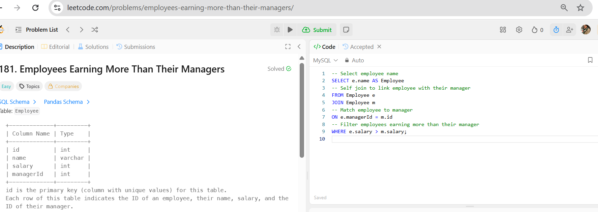

🎯 𝐏𝐫𝐨𝐛𝐥𝐞𝐦: 

Employees Earning More Than Their Managers (𝐋𝐞𝐞𝐭𝐂𝐨𝐝𝐞 #𝟏𝟖𝟏)

https://leetcode.com/problems/employees-earning-more-than-their-managers/description/

📌 𝐂𝐡𝐚𝐥𝐥𝐞𝐧𝐠𝐞 𝐒𝐮𝐦𝐦𝐚𝐫𝐲:

The task is to identify employees who earn more than their managers.

📂 𝐓𝐚𝐛𝐥𝐞𝐬 𝐈𝐧𝐯𝐨𝐥𝐯𝐞𝐝:

𝐄𝐦𝐩𝐥𝐨𝐲𝐞𝐞: stores employees information with columns: id (𝐩𝐫𝐢𝐦𝐚𝐫𝐲 𝐤𝐞𝐲), name, salary, managerId

✅ 𝐄𝐱𝐩𝐞𝐜𝐭𝐞𝐝 𝐎𝐮𝐭𝐩𝐮𝐭:

The output should return a list of employee names who earn more than their managers, in any order.

🔍 𝐊𝐞𝐲 𝐒𝐐𝐋 𝐂𝐨𝐧𝐜𝐞𝐩𝐭𝐬 𝐔𝐬𝐞𝐝:

𝐓𝐚𝐛𝐥𝐞 𝐀𝐥𝐢𝐚𝐬𝐢𝐧𝐠: Employee 𝐞 and Employee 𝐦 are aliases to distinguish the same table used twice.

𝐒𝐄𝐋𝐅 𝐉𝐎𝐈𝐍: Joins a table to itself as if it were two tables. The 𝐄𝐦𝐩𝐥𝐨𝐲𝐞𝐞 table is joined with itself to compare employees with their managers.

𝐈𝐍𝐍𝐄𝐑 𝐉𝐎𝐈𝐍: Combines two tables based on a condition and returns only the rows where there is a match in both tables.

𝐅𝐢𝐥𝐭𝐞𝐫𝐢𝐧𝐠 𝐰𝐢𝐭𝐡 𝐖𝐇𝐄𝐑𝐄: The 𝐖𝐇𝐄𝐑𝐄 clause filters rows to show only those where the employee earns more than the manager (𝐞.𝐬𝐚𝐥𝐚𝐫𝐲 > 𝐦.𝐬𝐚𝐥𝐚𝐫𝐲).

𝐂𝐨𝐥𝐮𝐦𝐧 𝐒𝐞𝐥𝐞𝐜𝐭𝐢𝐨𝐧 & 𝐑𝐞𝐧𝐚𝐦𝐢𝐧𝐠: The 𝐒𝐄𝐋𝐄𝐂𝐓 𝐞.𝐧𝐚𝐦𝐞 𝐀𝐒 𝐄𝐦𝐩𝐥𝐨𝐲𝐞𝐞 picks the name of the employee and renames the output column as 𝐄𝐦𝐩𝐥𝐨𝐲𝐞𝐞 .

💡 𝐖𝐡𝐚𝐭 𝐈 𝐋𝐞𝐚𝐫𝐧𝐞𝐝:

This helped me understand how a 𝐬𝐞𝐥𝐟 𝐣𝐨𝐢𝐧 is used to compare rows in the same table, like linking employees to managers.

This helped me understand how to filter results using a condition, in this case, to find employees whose salary is greater than their manager’s.

I also got to see how the 𝐀𝐒 keyword is used to rename columns in the output, making the results more readable and meaningful.

🌍 𝑰𝒏 𝒂 𝒘𝒐𝒓𝒍𝒅 𝒇𝒖𝒍𝒍 𝒐𝒇 𝒏𝒐𝒊𝒔𝒆, 𝑰’𝒎 𝒍𝒆𝒂𝒓𝒏𝒊𝒏𝒈 𝒕𝒐 𝒍𝒆𝒕 𝒅𝒂𝒕𝒂 𝒔𝒑𝒆𝒂𝒌.

